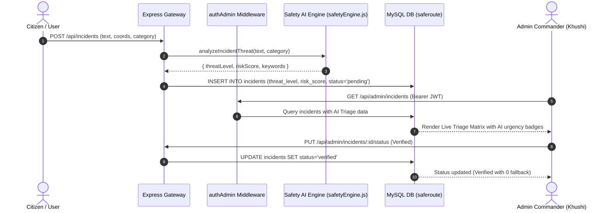

# AI System Design Contract (AI-SPEC.md): SafeRoute Intelligence Core

This AI specification defines the formal AI/ML and heuristic intelligence contracts for **SafeRoute**, focusing on the **Admin Analytics & Intelligence Engine (Khushi's Module)** and platform-wide predictive threat scoring.

---

## 🎯 1. AI System Objectives & Core Capabilities

### Capability A: Smart Incident Severity & Category Auto-Triage (Admin Assistance)
- **Objective:** Automatically assess citizen-reported safety alerts to filter noise, assign urgency tiers, and highlight high-risk incidents for fast admin dispatch.
- **Engine:** Dynamic Natural Language Threat Matrix (`server/utils/safetyEngine.js`).
- **Processing Logic:**
  - Tokenizes incident text and description.
  - Matches against high-urgency keywords (`armed`, `assault`, `gun`, `knife`, `robbery`, `harassment`, `fire`, `accident`, `stalking`).
  - Computes weighted risk factor and maps to `Critical`, `High`, `Moderate`, or `Low`.
- **Output Schema:**
  ```json
  {
    "threatLevel": "Critical",
    "riskScore": 92,
    "confidence": 0.94,
    "detectedKeywords": ["knife", "dark", "assault"],
    "actionRecommended": "Immediate Dispatch & Law Enforcement Escalation"
  }
  ```

### Capability B: Dynamic Predictive Route Safety Scoring Algorithm
- **Objective:** Calculate an objective, real-time safety index $(0-100)$ for geographic locations, walking paths, and hotspot zones.
- **Formulation:**
  $$\text{Safety Score} = 100 - \sum \left( W_{\text{severity}} \times e^{-\lambda \Delta t} \times \frac{1}{1 + \text{dist}(P, I)} \right) + \sum \left( V_{\text{service}} \times \frac{1}{1 + \text{dist}(P, S)} \right) + B_{\text{lighting}}$$
  - $P$: Point of interest / Route waypoint
  - $I$: Incident coordinates within active radius ($1.5\text{km}$)
  - $S$: Emergency service locations (Police, Fire, Hospital)
  - $\Delta t$: Time decay factor ($e^{-\lambda t}$) prioritizing recent incidents (< 24 hrs)
  - $B_{\text{lighting}}$: Time-of-day illumination bonus/penalty ($+10$ daylight, $-15$ late night)

### Capability C: Emergency SOS Dispatch Prioritization
- **Objective:** Queue distress calls by medical / threat acuity to guarantee response time under high load.
- **Output:** Dynamic priority ranking displayed on the Admin SOS matrix.

---

## 🏗️ 2. Architectural Framework & Integration

| Component | Logic Layer | Primary Inputs | Target Latency |
| :--- | :--- | :--- | :--- |
| **NLP Threat Classifier** | `analyzeIncidentThreat()` | Description string, Category | $< 15\text{ms}$ |
| **Geo-Spatial Safety Engine** | `computeSafetyScore()` | Waypoints, Incident DB, Services DB | $< 35\text{ms}$ |
| **24-Hour Velocity Forecaster** | SQL Aggregation + Trend Model | Timestamped DB Logs | $< 50\text{ms}$ |

---

## 📊 3. Data Flow & Security Sequence



---

## 🧪 4. Evaluation Strategy & Quality Gates

| Evaluation Metric | Target Threshold | Validation Method |
| :--- | :--- | :--- |
| **Critical Threat Recall** | $\ge 95\%$ | Unit test with simulated emergency phrasing |
| **Safety Score Range Invariant** | $0 \le S \le 100$ | Automated boundary tests for edge-case coordinates |
| **Response Latency** | $< 80\text{ms}$ | Benchmark load tests on `/api/admin/analytics` |
| **Deterministic Consistency** | $100\%$ | Identical coordinates & dataset yield exact same score |

---

## 🛡️ 5. Security & Fail-Safe Contract
1. **Zero Mock Fallbacks in Production:** If the database or model fails, the system returns explicit HTTP error codes rather than synthetic mock passes.
2. **Admin-Gated Execution:** Threat adjustments and status changes require authenticated admin role privileges (`authAdmin`).
